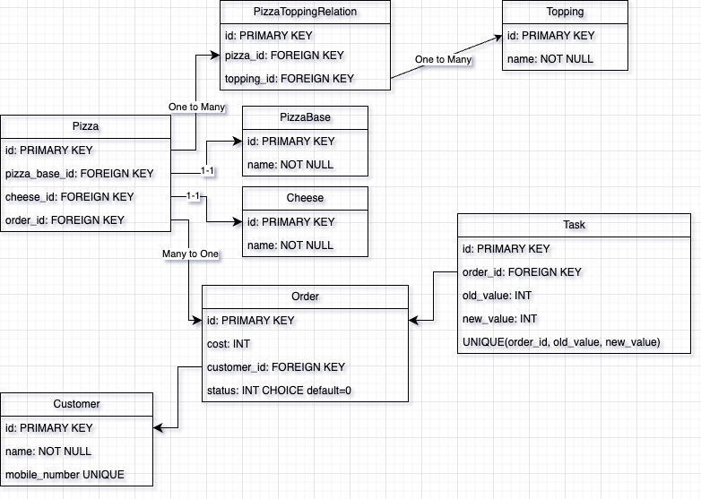

# My favourite Pizzaria

## Technology Used
* Django
* Redis
* Postgres
* Celery

## Datebase schema


## API Schema
```
POST
init_order() => 
* Registers customer
* Created order and attaches Customer to it
returns {'data': 'new order created'}

* If customer order exists and is int Init(0) state then return {'data':'order exists'}

POST
place_order()
* Takes pizza input, supports multiple pizzas in single order
* After storing info initiates Tasks

GET
get_orders()
get_pizza_bases()
get_cheese()
get_pizzas()
```

There is a file with all API requests that can be loaded into Postman/Insomnia in ```static``` folder

## Task Execution

The states an order can have are:
0: Init
1: Placed
2: Accepted
3: Prepared
4: Dispatched
5: Delivered

We define an Init state for the sole purpose of ensuring that a customer does not have 'Empty' orders in case they leave the session.

When ```initiate_long_task``` is called:
1. Tries to create an entry in Task table with values: ```order_id, old_value, new_value```.
2. Task table has a unique constraint on (order_id, old_value, new_value). Create fails if task already pushed to celery. This ensures that tasks are done only once.
3. Call sleep for the required time (1min, 3min, 5min) accordinly.
4. Update order status and then call ```initiate_long_task``` again with next status
5. When old_value is 5(last state) we don't create anymore tasks


## Run

Please have Docker installed

```
docker-compose up
```
